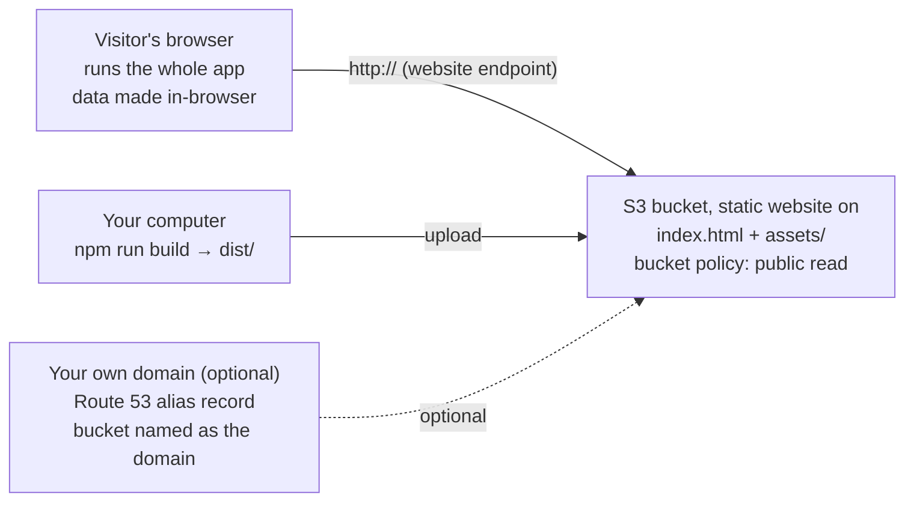

# Hosting the AI Ready Data Platform on AWS

Last updated: Oct 5, 2026

## Overview

Host the app directly from an Amazon S3 bucket with **static website hosting** turned on, no CloudFront: about 30 minutes the first time, and typically a few cents a month for demo traffic. The trade-off: the site is served over plain **HTTP** (browsers show "Not secure") and the bucket must be **publicly readable**.



You build the files once and upload them to the bucket; every visitor then loads them straight from the bucket's website address.

The AI Ready Data Platform is a **static website**. Running `npm run build` produces a `dist` folder of HTML, JavaScript and CSS files (about 3 MB). There is no server, no database and no login to run: all data is synthetic and generated in the visitor's browser, and demo state is kept in the browser's session storage. Hosting it therefore only means putting those files somewhere that serves them on the web.

| Option | What it is | Best when | Effort |
| --- | --- | --- | --- |
| **S3 static website** (this guide, steps 1–5) | S3 stores the files and serves them as a website itself | Quick internal demos where HTTP and a public bucket are acceptable | About 30 min, console only |
| **AWS Amplify Hosting** (alternative section) | Amplify connects to the GitHub repository, builds and hosts it with HTTPS | You need HTTPS, a password, or automatic redeploys on every push to `main` | About 15 min |

Check first that your company allows **public S3 buckets**: many company AWS accounts block them by policy, and then only the Amplify option will work. Neither option needs a code change: the app uses hash-based links (`/#/utilities/map`), so no server rewrite rules are required.

Words used in this guide:

- **Region**: the AWS data-centre location you work in, shown top right in the console (for example *US East (N. Virginia) us-east-1*). Pick one and stay in it.
- **S3 bucket**: a folder in AWS that stores files.
- **Static website hosting**: an S3 setting that makes a bucket answer web requests at its own address (the *website endpoint*).
- **Bucket policy**: the rules that say who may read the bucket's files.
- **Console**: the AWS website at [console.aws.amazon.com](https://console.aws.amazon.com), where you click through everything below.

## Before you start

You need an AWS account with billing enabled, a safe way to sign in, a budget alert, and Node.js plus Git on your own computer.

**1. AWS account.** If you don't have one, sign up at [aws.amazon.com](https://aws.amazon.com) (a credit card is required). If your company already has AWS, ask your cloud or IT team for an account (or a sandbox account) and for permission to use S3 and, optionally, Route 53. Ask whether they need a specific Region or naming convention, and whether public S3 buckets are allowed (if not, use the Amplify option).

**2. Sign in safely.**

1. The email you signed up with is the **root user**. Use it only for account setup. In the console, open your account name (top right) → *Security credentials* and turn on **MFA** (multi-factor authentication) with an authenticator app.
2. Create an everyday sign-in: search the console for **IAM Identity Center** (or **IAM** if your company does not use Identity Center), create a user for yourself and give it the **AdministratorAccess** permission set (or the narrower *AmazonS3FullAccess* if your team prefers). Sign out and sign back in as that user.

**3. Budget alert (2 minutes, strongly recommended).** Search the console for **Billing and Cost Management** → *Budgets* → *Create budget* → *Use a template* → **Monthly cost budget**. Set the amount to **$5** and enter your email. AWS will email you if spending heads past it, so a mistake can never run up a surprise bill.

**4. On your computer.**

- **Node.js 20 or newer** (the LTS version from [nodejs.org](https://nodejs.org)). Check it in a terminal (Command Prompt or PowerShell on Windows, Terminal on Mac) with `node --version`.
- **Git** from [git-scm.com](https://git-scm.com). Check with `git --version`.
- Access to the GitHub repository `CloudKatasani/AI-Ready-Data-Platform-Demo`.

No AWS command-line tools are needed for steps 1–5; everything happens in the browser. The command line is optional, for quicker updates later.

## Step 1: Build the app on your computer

The result of this step is a `dist` folder containing `index.html` and an `assets` folder: these are the only files AWS needs.

Open a terminal and run these commands one at a time:

```bash
git clone https://github.com/CloudKatasani/AI-Ready-Data-Platform-Demo.git
cd AI-Ready-Data-Platform-Demo
git checkout main
npm ci
npm run build
```

- `npm ci` downloads the libraries the app uses (1–3 minutes the first time).
- `npm run build` checks the code and writes the website into `dist`. It should end with a line like `✓ built in 12s`.

**Check it locally before uploading:** run `npm run preview` and open the address it prints (usually `http://localhost:4173`). You should see the start screen with the eight industry packs. Press `Ctrl + C` in the terminal to stop it.

If `npm` is not found, Node.js is not installed or the terminal was opened before installing it: close and reopen the terminal.

## Step 2: Create the S3 bucket

This bucket will be readable by anyone, so put nothing in it except the website files.

1. In the console search bar type **S3** and open it. Check the Region shown top right (for example *us-east-1*); remember it.
2. Click **Create bucket**.
3. **Bucket type:** *General purpose*.
4. **Bucket name:**
   - If you will use your own domain later (optional section), the name must be **exactly that domain**, for example `demo.yourcompany.com`.
   - Otherwise, any name unique worldwide, lowercase letters, numbers and hyphens, for example `ai-ready-data-platform-demo-<your-company>`.
   - Write it down.
5. **Object Ownership:** leave *ACLs disabled (recommended)*.
6. **Block Public Access settings:** **untick** *Block all public access*, then tick the warning box *I acknowledge that the current settings might result in this bucket and the objects within becoming public*. (If AWS refuses or the box is greyed out, your account blocks public buckets: ask your cloud team or use the Amplify option.)
7. **Bucket Versioning:** *Enable* (optional, lets you roll back a bad upload).
8. **Default encryption:** leave *SSE-S3*.
9. Click **Create bucket**.

The bucket exists but is not yet public: Step 4 adds the rule that lets visitors read it.

## Step 3: Upload the built files

Upload the **contents** of `dist`, not the `dist` folder itself, so that `index.html` sits at the top of the bucket.

1. Open your bucket in the S3 console and click **Upload**.
2. Click **Add files** and select `index.html` from your `dist` folder.
3. Click **Add folder** and select the `assets` folder inside `dist`. (Dragging both from your file explorer into the upload page also works.)
4. Leave every other setting as it is and click **Upload**. Wait for *Upload succeeded* (a few dozen files).
5. Back in the bucket you should see exactly two entries: `index.html` and `assets/`.

If you instead see a single `dist/` folder, open it, select everything inside, and use *Actions → Move* to move it up a level, or delete it and upload again.

## Step 4: Turn on website hosting and allow public reads

Two settings turn the bucket into a website: **static website hosting** gives it a web address, and a **bucket policy** lets anyone read the files.

**A. Turn on static website hosting**

1. Open your bucket → **Properties** tab → scroll to the bottom → **Static website hosting** → **Edit**.
2. **Static website hosting:** *Enable*. **Hosting type:** *Host a static website*.
3. **Index document:** `index.html`. **Error document:** `index.html` as well (anyone mistyping an address then lands on the app instead of an error page).
4. Click **Save changes**.
5. Back at the bottom of **Properties**, copy the **Bucket website endpoint**, for example `http://ai-ready-data-platform-demo-acme.s3-website-us-east-1.amazonaws.com`. That is your site's address.

**B. Allow anyone to read the files**

1. Open the **Permissions** tab → **Bucket policy** → **Edit**.
2. Paste the policy below, replacing `<bucket-name>` with your bucket's name (keep the `/*` at the end).
3. Click **Save changes**. The bucket now shows a red **Publicly accessible** label: that is expected for a website bucket.

```json
{
  "Version": "2012-10-17",
  "Statement": [
    {
      "Sid": "PublicReadForWebsite",
      "Effect": "Allow",
      "Principal": "*",
      "Action": "s3:GetObject",
      "Resource": "arn:aws:s3:::<bucket-name>/*"
    }
  ]
}
```

If saving fails with *Access denied* or *public policies are blocked*, Block Public Access is still on (Step 2, item 6), or your organisation forbids public buckets.

## Step 5: Open and test the site

Open the bucket website endpoint from Step 4 (it starts with `http://`, not `https://`) and run through this checklist:

- [ ] The start screen shows **AI Ready Data Platform** and the eight industry packs.
- [ ] Choosing **Utilities** opens the Platform Map; the address now ends in `/#/utilities/map`.
- [ ] Agent Studio answers the first starter question.
- [ ] Reloading the page (F5) on any tab keeps you on that tab.
- [ ] The address bar shows **Not secure**: expected, because S3 website endpoints serve HTTP only.
- [ ] Typing `https://` in front of the endpoint does **not** work: also expected. For HTTPS use the Amplify option.

The site is live. Share the endpoint address, or carry on with the optional sections to give it your own domain or restrict who can open it.

## Optional: your own domain name

You can serve the site at an address such as `http://demo.yourcompany.com`, but only over **HTTP**: S3 website endpoints cannot use an SSL certificate. If the domain must use `https://`, use the Amplify option instead.

**Requirement:** the bucket name must be exactly the domain name (`demo.yourcompany.com`). If your bucket has another name, create a new one with the right name and repeat steps 2–4 for it.

**If your domain is in Route 53:**

1. Open **Route 53** → **Hosted zones** → your domain (`yourcompany.com`) → **Create record**.
2. **Record name:** `demo`. **Record type:** *A*.
3. Switch on **Alias**. **Route traffic to:** *Alias to S3 website endpoint* → your bucket's Region → the bucket appears in the list (it only appears when its name matches the record exactly).
4. Click **Create records**. The address works within a few minutes.

**If another provider runs your DNS:** ask them for a **CNAME** record from `demo.yourcompany.com` to your bucket website endpoint without the `http://`, for example `demo.yourcompany.com.s3-website-us-east-1.amazonaws.com`. A CNAME cannot be used for the bare domain (`yourcompany.com`); use a subdomain such as `demo.`.

## Optional: limit who can see the demo

By default anyone with the address can open the site. The data is synthetic, so that is often fine; if you want a lock, these are the options without CloudFront.

| Option | Who gets in | Extra cost | Effort |
| --- | --- | --- | --- |
| **Office IP allow list** (bucket policy) | Only your company network or VPN | $0 | 10 min |
| **Password** | Anyone you give the password to | Not possible with S3 alone | Use the Amplify option (built-in password) |
| **Hard-to-guess address** | Anyone who has the link | $0 | Give the bucket a random-looking name in Step 2 |

### Office IP allow list in the bucket policy

1. Ask your network team for your company's public IP ranges (for example `203.0.113.0/24` and the VPN's range).
2. Open the bucket → **Permissions** → **Bucket policy** → **Edit**, and replace the Step 4 policy with the one below: the same rule plus a condition that the visitor's IP is in your ranges. Replace `<bucket-name>` and the IP ranges.
3. **Save changes**. Visitors outside those ranges get *403 Forbidden*. Test from your phone on mobile data to confirm.

```json
{
  "Version": "2012-10-17",
  "Statement": [
    {
      "Sid": "PublicReadFromOfficeOnly",
      "Effect": "Allow",
      "Principal": "*",
      "Action": "s3:GetObject",
      "Resource": "arn:aws:s3:::<bucket-name>/*",
      "Condition": {
        "IpAddress": { "aws:SourceIp": ["203.0.113.0/24", "198.51.100.0/24"] }
      }
    }
  ]
}
```

To open it to everyone again, put back the Step 4 policy.

## Publishing updates

Each update is: rebuild, then replace the files in the bucket. There is no cache to clear on the AWS side; visitors see the new version as soon as they reload.

**From the console (no tools to install)**

1. On your computer: `git pull` then `npm run build`.
2. In S3, open the bucket, tick `index.html` and `assets/`, and click **Delete** (type *permanently delete* to confirm).
3. Upload the new `index.html` and `assets` folder exactly as in Step 3.
4. Reload the site (Ctrl + Shift + R / Cmd + Shift + R skips your browser's own cache).

**From the command line (faster once set up)**

1. Install the [AWS CLI v2](https://docs.aws.amazon.com/cli/latest/userguide/getting-started-install.html).
2. Sign in once: `aws configure sso` if your company uses IAM Identity Center (follow the prompts), otherwise create an access key for your IAM user and run `aws configure`.
3. Then each release is two commands (replace the bucket name):

```bash
npm run build
aws s3 sync dist/ s3://<bucket-name>/ --delete
```

`--delete` removes files from the bucket that no longer exist in `dist`, so old builds don't pile up. The bucket policy and website settings stay as they are.

If you would rather publish automatically on every push to `main`, the Amplify alternative below does that with no scripting.

## Alternative: AWS Amplify Hosting

Use Amplify when you need HTTPS or a password, or when your company does not allow public S3 buckets. You never set up CloudFront yourself (Amplify uses it behind the scenes), and it replaces steps 1–5 and the update routine: it pulls the code from GitHub, builds it in AWS and hosts it, and rebuilds automatically on every push to `main`. It also has a built-in password option.

1. In the console search bar type **Amplify** and open **AWS Amplify**. Click **Create new app** (or *Deploy an app*).
2. Choose **GitHub** and click **Next**. A GitHub window asks you to authorise AWS Amplify and choose which repositories it may see: select `CloudKatasani/AI-Ready-Data-Platform-Demo`. (If the repository belongs to an organisation, an organisation owner may have to approve this.)
3. Pick the repository and the branch **main**. Click **Next**.
4. **App settings:** Amplify detects a Vite app. Check that the **build command** is `npm run build` and the **output directory** is `dist`. If you edit the build settings (*Edit YAML*), this is what it should contain:

```yaml
version: 1
frontend:
  phases:
    preBuild:
      commands:
        - nvm use 20
        - npm ci
    build:
      commands:
        - npm run build
  artifacts:
    baseDirectory: dist
    files:
      - '**/*'
  cache:
    paths:
      - node_modules/**/*
```

5. Click **Next**, then **Save and deploy**. The first build takes about 3–5 minutes; each stage turns green.
6. Open the **Domain** shown on the app page (for example `https://main.d1abc2def3.amplifyapp.com`) and run the Step 5 checklist.

**Password-protect it:** app → **Hosting** → **Access control** → *Manage access* → set the `main` branch to **Restricted - password required**, enter a username and password, **Save**.

**Custom domain:** app → **Hosting** → **Custom domains** → **Add domain**. Amplify requests the certificate for you; with Route 53 it also adds the DNS records, otherwise it lists the records to give your DNS team.

**Updates:** merge or push to `main`; Amplify builds and publishes on its own within a few minutes. Build minutes and hosting are billed per use, typically well under $5 a month for a demo.

## Costs and how to remove everything

For demo traffic an S3 static website typically costs a few cents a month. Figures below are approximate list prices; confirm on the [S3](https://aws.amazon.com/s3/pricing/), [Route 53](https://aws.amazon.com/route53/pricing/) and [Amplify](https://aws.amazon.com/amplify/pricing/) pricing pages for your Region.

| Item | Approximate cost | Notes |
| --- | --- | --- |
| S3 storage (about 3 MB) | Under $0.01 a month | |
| S3 requests | About $0.0004 per 1,000 file downloads | One visit fetches a handful of files |
| Data sent to visitors | $0 for the first 100 GB a month, then about $0.09 per GB | A visit downloads about 1 MB, so 100 GB is roughly 100,000 visits |
| Route 53 hosted zone | About $0.50 a month | Only with your own domain in Route 53; registering a `.com` is about $15 a year |
| Amplify Hosting (alternative) | Usually under $5 a month | Billed per build minute, GB stored and GB served |

**To remove everything:**

1. **S3:** select the bucket → **Empty** (type *permanently delete*) → then **Delete** the bucket.
2. **Route 53 (if used):** delete the `demo` record you added.
3. **Amplify (if used):** app → **App settings** → **General settings** → **Delete app**.
4. Keep the budget alert, or delete it under *Billing and Cost Management → Budgets*.

## Troubleshooting

| What you see | Likely cause | Fix |
| --- | --- | --- |
| *403 Forbidden* / *AccessDenied* at the website address | Bucket policy missing, or Block Public Access still on | Untick Block Public Access (Step 2, item 6) and add the bucket policy (Step 4 B) |
| *403 Forbidden* only for some people | IP allow list in the bucket policy | Add their network's range, or put back the Step 4 policy |
| *404 Not Found*, *NoSuchKey* | Index document not set, or files uploaded inside a `dist/` folder | Set **Index document** to `index.html` (Step 4 A); bucket must show `index.html` and `assets/` at the top level (Step 3) |
| *404* with code *NoSuchWebsiteConfiguration* | Static website hosting not enabled | Enable it under **Properties** (Step 4 A) |
| You get a file listing or XML instead of the app | You opened the bucket's storage address, not the website endpoint | Use the address from **Properties → Static website hosting** (contains `s3-website`) |
| Blank white page | Only `index.html` uploaded, `assets` missing or from another build | Upload the `assets` folder from the same build |
| Old version still showing | Browser cache | Hard-reload with Ctrl + Shift + R (Cmd + Shift + R on Mac) |
| Browser says **Not secure** | Expected: S3 websites are HTTP only | For HTTPS use the Amplify option |
| Your domain does not open the site | Bucket name differs from the domain, or DNS record missing | Bucket must be named exactly like the domain; check the Route 53 alias or CNAME |
| `npm run build` fails | Node.js older than 20 | Install the current Node.js LTS and run `npm ci` again |
| Amplify build fails at `npm ci` | Build image uses an old Node.js | Keep `nvm use 20` in the build settings (Amplify section) |
| Demo shows earlier choices (persona, incidents) | Demo state is kept per browser tab | Use **⋯ → Reset demo** in the app, or open a new tab |

Still stuck: the bucket's **Properties** and **Permissions** tabs show every setting this guide changes, and the Amplify build log names the failing command. Your cloud team can check it quickly with this guide in hand.
